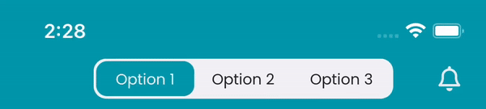

# React Native iOS Native Tab Bar





This package provides a custom component for integrating the native tab bar of iOS into your React Native app. With this
package, you can achieve a seamless native tab navigation experience in the iOS version of your application.

## Features

- Integrate iOS's default tab bar into your React Native project.
- Customize the appearance with easy configuration options.
- Ability to customize icons and text for each tab.

## Installation

- Using NPM

   ```shell
  npm install react-native-ios-tab-bar
   ```

## Usage

1. Import the components into your project
   ```js
   import { RNTabBar, RNTabBarOption } from "react-native-ios-tab-bar";
   ```
2. Use the component in your project
   ```js
       // Within your render function
       // Wrap options with RNTabBar
       <RNTabBar>  
   
         <RNTabBarOption>
             <Text>Option1</Text>  
         </RNTabBarOption>  
         
         <RNTabBarOption>  
             <Text>Option2</Text>  
         </RNTabBarOption>  
         
       </RNTabBar>
   ```

## API

***Note: None of the options are mandatory!***

### Tab Bar

| Option                  | *Type*                      |
|-------------------------|-----------------------------|
| **activeIndex**         | *number*                    |
| **onActiveIndexChange** | *( index: number ) => void* |
| **activeColor**         | *string*                    |
| **backgroundColor**     | *string*                    |
| **width**               | *number*                    |
| **height**              | *number*                    |
| **borderRadius**        | *number*                    |
| **padding**             | *number*                    |

### Tab Bar Option

| Option             | *Type*                          |
|--------------------|---------------------------------|
| **index**          | *number*                        |
| **activeIndex**    | *number*                        |
| **onActiveChange** | *( isActive: boolean ) => void* |
| **onActive**       | *( ) => void*                   |
| **onPress**        | *( ) => void*                   |

## Contributing

All contributions are welcome.
If you would like to contribute to this project, feel free to submit pull requests.
Prior to making significant changes, I recommend opening an issue to discuss the changes.

## License

This project is licensed under the MIT license. For more information, refer to the `LICENSE` file.
